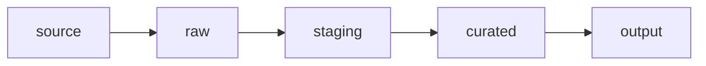

# Workflow Layers

All workflows in this repository follow one convention:

```text
source → raw → staging → curated → output
```

**Notebooks are the primary working interface.** Each layer maps to notebook sections (and optional SQL templates). Keep layers separate so you can re-run ingestion without rebuilding business logic, and re-run validation before every export.

## Layer Overview

| Layer | What it is | Typical location | Mutability |
|-------|------------|------------------|------------|
| `source` | External system or file you do not own | URLs, APIs, vendor drops, `data/source/` mirrors | Read-only reference |
| `raw` | As-ingested snapshot | DuckDB schema `raw`; optional `data/raw/` files | Replace on re-ingest |
| `staging` | Cleaned, typed, standardized | DuckDB schema `staging` | Rebuilt from `raw` |
| `curated` | Business-ready models | DuckDB schema `curated` | Versioned logic |
| `output` | Deliverables for consumers | `data/output/` files | Published artifacts |



## Layer Rules of Thumb

1. **Never skip `raw`** — keep an auditable copy of what arrived from `source`.
2. **Do business logic in `staging` or `curated`**, not during ingest.
3. **Validate before `output`** — row counts, keys, ranges, geometry validity.
4. **One notebook section per layer** — short cells you can re-run independently.

---

## Tabular Example: Online Population CSV

End-to-end path using a real-world dataset.

### 1. source

External CSV hosted on GitHub (you do not control schema changes).

```text
https://raw.githubusercontent.com/datasets/population/master/data/population.csv
```

### 2. raw

Register as-is in DuckDB:

```sql
CREATE SCHEMA IF NOT EXISTS raw;

CREATE OR REPLACE TABLE raw.raw_population_csv AS
SELECT *
FROM read_csv_auto(
  'https://raw.githubusercontent.com/datasets/population/master/data/population.csv'
);
```

### 3. staging

Cast types, rename columns, filter bad rows:

```sql
CREATE SCHEMA IF NOT EXISTS staging;

CREATE OR REPLACE TABLE staging.stg_population AS
SELECT
  country_name,
  CAST(year AS INTEGER) AS year,
  CAST(value AS DOUBLE) AS population
FROM raw.raw_population_csv
WHERE value IS NOT NULL
  AND TRY_CAST(year AS INTEGER) IS NOT NULL;
```

Notebook cell to keep recent years only:

```python
con.execute("""
CREATE OR REPLACE TABLE staging.stg_population_recent AS
SELECT *
FROM staging.stg_population
WHERE year >= 2000;
""")
```

### 4. curated

Business grain: one row per country per year with derived fields.

```sql
CREATE SCHEMA IF NOT EXISTS curated;

CREATE OR REPLACE TABLE curated.cur_population_by_country AS
SELECT
  country_name,
  year,
  population,
  population - LAG(population) OVER (
    PARTITION BY country_name ORDER BY year
  ) AS yoy_change
FROM staging.stg_population;
```

### 5. output

Export for dashboards or downstream tools:

```sql
COPY (
  SELECT *
  FROM curated.cur_population_by_country
  WHERE year >= 2010
) TO 'data/output/population_by_country.parquet'
(FORMAT PARQUET);
```

### Validation (between staging and output)

```sql
-- Duplicate key check
SELECT country_name, year, COUNT(*) AS n
FROM staging.stg_population
GROUP BY 1, 2
HAVING COUNT(*) > 1;
```

---

## Spatial Example: GeoJSON Regions

Same layers; geometry stays in SQL via the `spatial` extension.

### 1. source

Public GeoJSON (state or admin boundaries).

```text
https://raw.githubusercontent.com/glynnbird/usstatesgeojson/master/california.geojson
```

### 2. raw

```sql
INSTALL spatial;
LOAD spatial;

CREATE OR REPLACE TABLE raw.raw_ca_regions_geojson AS
SELECT *
FROM ST_Read(
  'https://raw.githubusercontent.com/glynnbird/usstatesgeojson/master/california.geojson'
);
```

**Other spatial sources** use the same `raw` pattern:

| Format | Typical read pattern |
|--------|----------------------|
| Shapefile | `ST_Read('data/source/parcels.shp')` or zip URL |
| GeoParquet | `ST_Read('data/source/boundaries.parquet')` |
| FileGDB | `ST_Read('data/source/city.gdb', layer='Zoning')` |

### 3. staging

Standardize geometry and attributes:

```sql
CREATE OR REPLACE TABLE staging.stg_ca_regions AS
SELECT
  properties.NAME AS region_name,
  ST_MakeValid(geom) AS geom
FROM raw.raw_ca_regions_geojson
WHERE geom IS NOT NULL
  AND NOT ST_IsEmpty(geom);
```

Spatial EDA in a notebook cell:

```sql
SELECT
  ST_GeometryType(geom) AS geom_type,
  COUNT(*) AS n
FROM staging.stg_ca_regions
GROUP BY 1;
```

### 4. curated

Analysis-ready layer (e.g., simplified for web):

```sql
CREATE OR REPLACE TABLE curated.cur_ca_regions AS
SELECT
  region_name,
  ST_SimplifyPreserveTopology(geom, 100) AS geom
FROM staging.stg_ca_regions;
```

### 5. output

```sql
-- GeoParquet for analytics
COPY (
  SELECT region_name, geom
  FROM curated.cur_ca_regions
) TO 'data/output/ca_regions.parquet'
(FORMAT PARQUET);

-- GeoJSON for web maps
COPY (
  SELECT region_name, geom
  FROM curated.cur_ca_regions
) TO 'data/output/ca_regions.geojson'
(FORMAT GDAL, DRIVER 'GeoJSON');
```

---

## What Belongs Where?

| Activity | Layer |
|----------|-------|
| Download / register URL or path | `source` → `raw` |
| `read_csv_auto`, `ST_Read`, `read_parquet` | `raw` |
| `TRY_CAST`, trim text, dedupe, rename columns | `staging` |
| Joins, aggregates, spatial overlay, business rules | `staging` or `curated` |
| Models consumed by reports or exports | `curated` |
| `COPY ... TO` files | `output` |
| Null checks, key uniqueness, CRS validity | validation (any layer before publish) |

## Re-Run Strategy

| If this changed… | Re-run from… |
|------------------|--------------|
| Source file or URL | `raw` → downstream |
| Cleaning rules only | `staging` → downstream |
| Business metric definition | `curated` → `output` |
| Export format or path | `output` only |

## Notebook Section Template

Use this outline in pipeline notebooks:

```text
1. Setup — connect, extensions, schemas
2. Ingest — source → raw
3. Stage — raw → staging
4. Validate — checks on staging (and curated)
5. Curate — staging → curated
6. Export — curated → output
```

See [project structure](project_structure.md) for where notebooks and SQL templates live.

## Related Pages

- [Naming conventions](naming_conventions.md) — table prefixes per layer
- [What is DuckDB?](what_is_duckdb.md)
- [When to use DuckDB](when_to_use_duckdb.md)
